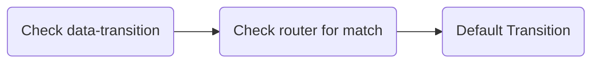
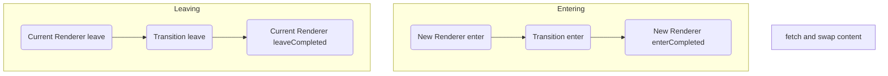

<p align="center"><strong>Taxi.js is the spiritual successor to Highway.js.</strong></p>

<p align="center">Full docs on the way!</p>

<p align="center">
  <code>npm i @unseenco/taxi</code> or <code>yarn add @unseenco/taxi</code>
</p>


Taxi is a js library for adding AJAX navigation and beautiful transitions to your website. 

It was designed as a drop-in replacement for [Highway.js](https://github.com/Dogstudio/highway) which is sadly no longer maintained.

### Improvements over Highway:

* URL-based routing
* Better cache management
* Ability to preload URLs
* Opt-in ability to stop navigation during an active transition
* Auto runs javascript on the new page
* Previous page's content is automatically removed (you can opt out of this if you like)
* Click events on links can be intercepted via `stopPropagation` without hacks 
* No annoying messages in the console...


### Differences to Highway
* Different public API
* New methods and functionality
* `data-taxi` and `data-taxi-view` are to be used instead of `data-router-wrapper` and `data-router-view` respectively.
* `attach` and `detach` are no longer methods - link clicks are listened to via delegation so these are no longer needed.
* `redirect` is now `navigateTo` as "redirect" felt weird as a method name!
* The params passed to renderers, transitions, and events are now a little different


# Table of Contents
* [How to Use](#how-to-use)
  * [Parameters](#parameters)  
* [Transitions and Routing](#transitions-and-routing)
  * [Routing 101](#routing-101)
* [Navigation Lifecycle](#navigation-lifecycle)
* [API](#api)
* [Events](#events)


# How to Use
Simply import `Taxi.Core` into your code and create a new instance:

```js
import { Core } from '@unseenco/taxi'

const Taxi = new Core({ ... })
```

Then amend your HTML so that `data-taxi` is added  to the parent of the content you want to replace during a transition, and `data-taxi-view` is added to the element you are replacing.

The `data-taxi-view` element **has to be the only child** of `data-taxi`.

```html
<main data-taxi>
  <article data-taxi-view>
    ...
  </article>
</main>
```
Now when you navigate in your app, `data-taxi-view` will be replaced with the `data-taxi-view` from the target URL instead of the whole page loading 🥳

### Parameters
When creating a new Taxi instance, you can pass an object of parameters into the constructor: 

| Param | Type | Default | Description |
|---|---|---|---|
| links | `string` | `'a:not([target]):not([href^= \\ #]):not([data-taxi-ignore])'` | Which links should Taxi intercept. |
| removeOldContent | `boolean` | `true` | Taxi will remove the previous page's content after the Transition's `onLeave` method has finished. Set this to false to disable this behaviour. |
| renderers | `Object.<string, Renderer>` | `{ default: Taxi.Renderer }` | All Renderers for the project. |
| transitions | `Object.<string, Transition>` | `{ default: Taxi.Transition }` | All Transitions for the project. |
| reloadJsFilter | `bool\|function(element: HTMLElement)` | `function` | See [running JS on new pages](#running-js-on-new-pages) for details. |


# Renderers


```js
import { Renderer } from '@unseenco/taxi';

export default class CustomRenderer extends Renderer {
  // Hooks/methods
  onEnter() { [...] }
  onLeave() { [...] }
  onEnterCompleted() { [...] }
  onLeaveCompleted() { [...] }
}
```


# Transitions and Routing

Taxi has a distinct heirarchy when it comes to choosing which transition to run during a navigation:



#### 1. Explicit Transition
If a user clicks a link with `data-transition="something"` present, then the "something" transition will be used. 

These are for special cases really, as browser navigation (back/forward buttons) will never trigger this.

#### 2. Route Transition
If there was no explicit transition, then Taxi will next check the defined routes to see if a contextual transition can be matched.

#### 3. Default Transition
As there was no explicit transition, and no matches from the router, finally the default transition will be used.

## Routing 101
Routes are defined in Taxi as a regex to run against the current URL, and one to run against the new URL after the navigation.

### Route Ordering
Routes are tested in **the same order they are declared**, and as soon as a match is found, that transition is chosen.


Lost? Well consider the following:

```js
// bad
taxi.addRoute('/pages/.*', '/', 'somethingElse')
taxi.addRoute('/pages/specific', '/', 'something')

// good
taxi.addRoute('/pages/specific', '/', 'something')
taxi.addRoute('/pages/.*', '/', 'somethingElse')
```

In the above example, if the user was navigating from `/pages/specific` to the homepage, only the second example would match and run the "something" transition.

This is because the first example registers the catch all **before** the specific rule, so the specific one is never reached.


**Please note:** Your regex is wrapped inside `^` and `$` automatically, so a regex of `/api` will match `/api` **but not** `/v2/api`. Keep this in mind when adding routing rules!


# Navigation Lifecycle
Now that we have explained Renderers and Transitions, how does it all fit together? Hopefully the below diagram should help!


Let's use a **real world example**.

1. A user clicks a link in your app
2. Taxi [checks to see which Transition](#transitions-and-routing) should be used
3. The current Renderer's `onLeave` method is called
4. Then the chosen Transition's `onLeave`
5. Then the Renderer's `onLeaveCompleted`
6. Next, Taxi will go and fetch the new page the user has requessted, and swap the current page's content to this new content as soon as it's ready
7. Taxi will look at the new page content and call the `onEnter` method of the Renderer set via the new page's `data-taxi-view` attribute, or the default if not defined
8. Then call the Transition's `onEnter` method
9. Then what the transition is all finished, finally the new Renderer's `onEnterComplete` is called


# API

### `addRoute(fromPattern: string, toPattern: string, transition: string): void`
Registers a route into the RouteStore.

### `navigateTo(url: string, transition?: string = false): Promise`
Perform a manual navigation to the provided URL.

If a `transition` name is not provided then Taxi will try and find a match in the RouteStore, otherwise the default transition will be used.

### `preload(url: string): Promise`
prefetch the provided URL and add it to the cache ahead of any user navigation.

### `updateCache(): void`
Updates the HTML cache for the current URL.

Useful when adding/removing content via AJAX such as a search page or infinite loader

### `deleteCache(url?: string): void`
Remove the cached HTML for the provided URL. If no URL provided, remove cache for the current URL.

### `setDefaultRenderer(renderer: string): void`
If you don't like "default" as the name of your default renderer, you can change the default renderer to be anything you like here.

### `setDefaultTransition(renderer: string): void`
Same as `setDefaultRenderer`, but for the transitions instead.

### `on(event: string, callback: function): void`
Add an [event listener](#events).

### `off(event: string, callback?: function)`
Remove an [event listener](#events). If no callback is supplied, then remove all listeners for the provided event.


# Events
