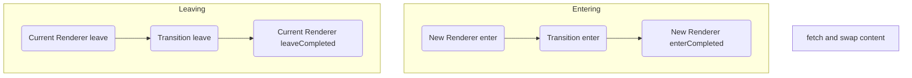
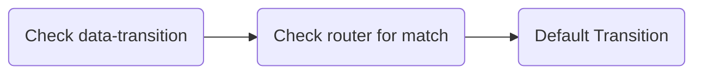

<p align="center"><strong>Taxi.js is the spiritual successor to Highway.js.</strong></p>

<p align="center">Full docs on the way!</p>

<p align="center">
  <code>npm i @unseenco/taxi</code> or <code>yarn add @unseenco/taxi</code>
</p>


Taxi is a js library for adding AJAX navigation and beautiful transitions to your website. 

It was designed as a drop-in replacement for [Highway.js](https://github.com/Dogstudio/highway) which is sadly no longer maintained.

### Improvements over Highway:

* URL-based routing
* Better cache management
* Ability to preload URLs
* Opt-in ability to stop navigation during an active transition
* Auto runs javascript on the new page
* Previous page's content is automatically removed (you can opt out of this if you like)
* Click events on links can be intercepted via `stopPropagation` without hacks 
* No annoying messages in the console...


### Differences to Highway
* Different public API
* New methods and functionality
* `data-taxi` and `data-taxi-view` are to be used instead of `data-router-wrapper` and `data-router-view` respectively.
* `attach` and `detach` are no longer methods - link clicks are listened to via delegation so these are no longer needed.
* `redirect` is now `navigateTo` as "redirect" felt weird as a method name!
* Renderers now have an `initialLoad` method
* The params passed to renderers, transitions, and events are now a little different


# Table of Contents
* [How to Use](#how-to-use)
  * [Parameters](#parameters)  
* [Navigation Lifecycle](#navigation-lifecycle)
* [Renderers](#renderers)
  * [Running code on the initial visit to your site](#running-code-on-the-initial-visit-to-your-site) 
* [Transitions](#transitions)
  * [How transitions are chosen](#how-transitions-are-chosen)
* [Routing](#routing)
* [Running JS on New Pages](running-js-on-new-pages)
* [API](#api)
* [Events](#events)


# How to Use
Simply import `Taxi.Core` into your code and create a new instance:

```js
import { Core } from '@unseenco/taxi'

const Taxi = new Core({ ... })
```

Then amend your HTML so that `data-taxi` is added  to the parent of the content you want to replace during a transition, and `data-taxi-view` is added to the element you are replacing.

The `data-taxi-view` element **has to be the only child** of `data-taxi`.

```html
<main data-taxi>
  <article data-taxi-view>
    ...
  </article>
</main>
```
Now when you navigate in your app, `data-taxi-view` will be replaced with the `data-taxi-view` from the target URL instead of the whole page loading 🥳

### Parameters
When creating a new Taxi instance, you can pass an object of parameters into the constructor: 

| Param | Type | Default | Description |
|---|---|---|---|
| links | `string` | `'a:not([target]):not([href^= \\ #]):not([data-taxi-ignore])'` | Which links should Taxi intercept. |
| removeOldContent | `boolean` | `true` | Taxi will remove the previous page's content after the Transition's `onLeave` method has finished. Set this to false to disable this behaviour. |
| renderers | `Object.<string, Renderer>` | `{ default: Taxi.Renderer }` | All Renderers for the project. |
| transitions | `Object.<string, Transition>` | `{ default: Taxi.Transition }` | All Transitions for the project. |
| reloadJsFilter | `bool\|function(element: HTMLElement)` | `function` | See [running JS on new pages](#running-js-on-new-pages) for details. |


# Navigation Lifecycle
Now that we have explained Renderers and Transitions, how does it all fit together? Hopefully the below diagram should help!


Let's use a **real world example**.

1. A user clicks a link in your app
2. Taxi [checks to see which Transition](#transitions-and-routing) should be used
3. The current Renderer's `onLeave` method is called
4. Then the chosen Transition's `onLeave`
5. Then the Renderer's `onLeaveCompleted`
6. Next, Taxi will go and fetch the new page the user has requessted, and swap the current page's content to this new content as soon as it's ready
7. Taxi will look at the new page content and call the `onEnter` method of the Renderer set via the new page's `data-taxi-view` attribute, or the default if not defined
8. Then call the Transition's `onEnter` method
9. Then what the transition is all finished, finally the new Renderer's `onEnterComplete` is called


# Renderers
A Renderer is run everytime a page is shown or hidden when using Taxi. They are an ideal place to init/destroy components on the page, or play intro animations.

All Renderers should extend `@unseenco/taxi.Renderer` and look something like this:

```js
import { Renderer } from '@unseenco/taxi';

export default class CustomRenderer extends Renderer {
  onEnter() {
    // run after the new content has been added to the Taxi container
  }
  
  onEnterCompleted() {
     // run after the transition.onEnter has fully completed
  }
  
  onLeave() {
    // run before the transition.onLeave method is called
  }
  
  onLeaveCompleted() { 
    // run after the transition.onleave has fully completed
  }
}
```

The following props are available within Renderer methods:
* `this.page` : The entire document that is being rendered
* `this.title` : The document.title of the page being rendered
* `this.wrapper` : A reference to the current `data-taxi` main wrapper
* `this.content` :  A reference to the `data-taxi-view` which is being added to the DOM

### Running code on the initial visit to your site
Renderers are called whenever a navigation taes place, but the correct Renderer is also called when a user first visits your site.

There may be things you want to setup at this time such as persistant components liek navigation, or smoothscroll for example.

To aid with this, Renderers also have an `initialLoad` method which is only run on a user's first visit.

As no navigation has taken place, Taxi won't fire your Renderer's `onEnter` or `onEnterCompleted` methods, so we suggest running them here is a good idea:

```js
import { Renderer } from '@unseenco/taxi';

export default class CustomRenderer extends Renderer {
  initialLoad() {
    // run code that should only happen once for your site
    
    this.onEnter()
    this.onEnterCompleted()
  }
  
  // rest of your methods
}
```


# Transitions
Whenever a user navigates on your site, a Transition class is run to provide the fancy animation between the two pages.

A transition consists of an `onLeave` method called when leaving the current page, and an `onEnter` method which is called after the new content has been added to the DOM.

Each method is passed an object  containing the `done()` promise resolve function to call when your animation is finished, and the `trigger` that caused the navigation (either `'popstate'` for browser navigation, the `Element` if a link click, or `false` if the navigation was caused programatically via `navigateTo`.

The methods are also passed a reference to the active `data-taxi-view`: When leaving the current `data-taxi-view` is passed, and when entering the new `data-taxi-view` is passed instead:

```js
import { Transition } from '@unseenco/taxi'

export default class DefaultTransition extends Transition {
  /**
   * Handle the transition leaving the previous page.
   * @param {{from: HTMLElement, trigger: string|HTMLElement|false, done: function}} props
   */
  onLeave({ from, trigger, done }) {
    done()
  }

  /**
   * Handle the transition entering the next page.
   * @param {{ to: HTMLElement, trigger: string|HTMLElement|false, done: function }} props
   */
  onEnter({ to, trigger, done }) {
    done()
  }
}
```

`this.wrapper` is also available, which is a reference to the main `data-taxi` container.

### How transitions are chosen
Taxi has a distinct heirarchy when it comes to choosing which transition to run during a navigation:



#### 1. Explicit Transition
If a user clicks a link with `data-transition="something"` present, then the "something" transition will be used. 

These are for special cases really, as browser navigation (back/forward buttons) will never trigger this.

#### 2. Route Transition
If there was no explicit transition, then Taxi will next check the [defined routes](#routing) to see if a contextual transition can be matched.

#### 3. Default Transition
As there was no explicit transition, and no matches from the router, finally the default transition will be used.


# Routing
Routes are defined in Taxi as a regex to run against the current URL, and one to run against the new URL after the navigation.

### Route Ordering
Routes are tested in **the same order they are declared**, and as soon as a match is found, that transition is chosen.


Lost? Well consider the following:

```js
// bad
taxi.addRoute('/pages/.*', '/', 'somethingElse')
taxi.addRoute('/pages/specific', '/', 'something')

// good
taxi.addRoute('/pages/specific', '/', 'something')
taxi.addRoute('/pages/.*', '/', 'somethingElse')
```

In the above example, if the user was navigating from `/pages/specific` to the homepage, only the second example would match and run the "something" transition.

This is because the first example registers the catch all **before** the specific rule, so the specific one is never reached.


**Please note:** Your regex is wrapped inside `^` and `$` automatically, so a regex of `/api` will match `/api` **but not** `/v2/api`. Keep this in mind when adding routing rules!


## Running JS on New Pages
Taxi allows automatic reload and running of js present on a fetched page during the navigation cycle. This is especially useful when working with traditional CMS's such as WordPress or Magento, or if you wanted to split your js if you have a particularly heavy page.

It will also parse and execute inline js, allowing you to add data to the `window` object for example.

If enabled, this feature will run just after the `NAVIGATE_IN` event, after the new content has been appended to the DOM, but before the `Renderer.onEnter` method is called.

### Choosing which scripts are reloaded
By default all js is parsed and reloaded/executed.

To stop this behaviour for a sepcific script, just add `data-no-reload` to the script tag to make Taxi skip it.

```html
<!-- reloaded -->
<script src="/foo.js" />

<!-- this is not reloaded -->
<script src="/bar.js" data-no-reload />
```
This isn't always possible however as you might not have control over the `<script />` tags. In these instances, `reloadJsFilter` accepts a callback function to filter  each `script` tag and return a `boolean` to indicate if it should be reloaded or not.

Here is the default `reloadJsFilter` as an example which ensures browserSync is not reloaded by default:

```js
reloadJsFilter = (element) => !(element?.id === '__bs_script__' || element?.src.includes('browser-sync-client.js'))
```

Providing a callback as the one above provides you with fine control over which scripts are reloaded.


### Disabling this feature
Just set `reloadJsFilter` to false when initing Taxi:

```js
import { Core } from '@unseenco/taxi'

const Taxi = new Core({
  reloadJsFilter: false
})
```


# API

### `addRoute(fromPattern: string, toPattern: string, transition: string): void`
Registers a route into the RouteStore.

### `navigateTo(url: string, transition?: string = false): Promise`
Perform a manual navigation to the provided URL.

If a `transition` name is not provided then Taxi will try and find a match in the RouteStore, otherwise the default transition will be used.

### `preload(url: string): Promise`
prefetch the provided URL and add it to the cache ahead of any user navigation.

### `updateCache(): void`
Updates the HTML cache for the current URL.

Useful when adding/removing content via AJAX such as a search page or infinite loader

### `deleteCache(url?: string): void`
Remove the cached HTML for the provided URL. If no URL provided, remove cache for the current URL.

### `setDefaultRenderer(renderer: string): void`
If you don't like "default" as the name of your default renderer, you can change the default renderer to be anything you like here.

### `setDefaultTransition(renderer: string): void`
Same as `setDefaultRenderer`, but for the transitions instead.

### `on(event: string, callback: function): void`
Add an [event listener](#events).

### `off(event: string, callback?: function)`
Remove an [event listener](#events). If no callback is supplied, then remove all listeners for the provided event.


# Events
Events are handled by [@unseenco/e](https://www.npmjs.com/package/@unseenco/e) and work as they did in Highway.js.

### Adding Listeners
```js
import { Core } from '@unseenco/taxi'

const Taxi = new Core({ ... })

// This event is sent everytime a `data-taxi-view` is added to the DOM
Taxi.on('NAVIGATE_IN', ({ to, trigger, location }) => {
  // ...
});

// This event is sent before the `onLeave()` method of a transition is run to hide a `data-router-view`
Taxi.on('NAVIGATE_OUT', ({ from, trigger, location }) => {
  // ...
});

// This event is sent everytime the `done()` method is called in the `onEnter()` method of a transition
Taxi.on('NAVIGATE_END', ({ to, from, trigger, location }) => {
  // ...
});
```

### Removing Listeners
You can call `Taxi.off(event_name)` to remove all listeners for an event, or pass the callback to remove just that listener instead:

```js
function foo() { // ... }

Taxi.on('NAVIGATE_OUT', foo)

// Remove just the foo listener
Taxi.off('NAVIGATE_OUT', foo)

// remove all listeners
Taxi.off('NAVIGATE_IN')
```
