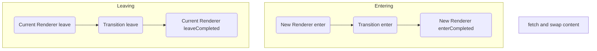

# Navigation Lifecycle
Now that we have explained Renderers and Transitions, how does it all fit together? Hopefully the below diagram should help!

Let's use a **real world example**.

1. A user clicks a link in your app
2. Taxi [checks to see which Transition](#transitions-and-routing) should be used
3. The current Renderer's `onLeave` method is called
4. Then the chosen Transition's `onLeave`
5. Then the Renderer's `onLeaveCompleted`
6. Next, Taxi will go and fetch the new page the user has requested, and swap the current page's content to this new content as soon as it's ready
7. Taxi will look at the new page content and call the `onEnter` method of the Renderer set via the new page's `data-taxi-view` attribute, or the default if not defined
8. Then call the Transition's `onEnter` method
9. Finally when the transition is all finished, the new Renderer's `onEnterComplete` is called
