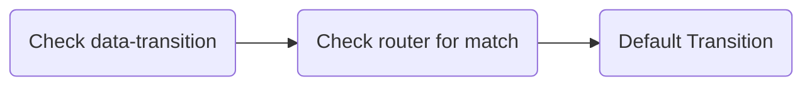

# Transitions
Whenever a user navigates on your site, a Transition class is run to provide the fancy animation between the two pages.

A transition consists of an `onLeave` method called when leaving the current page, and an `onEnter` method which is called after the new content has been added to the DOM.

Each method is passed an object  containing the `done()` promise resolve function to call when your animation is finished, and the `trigger` that caused the navigation (either `'popstate'` for browser navigation, the `Element` if a link click, or `false` if the navigation was caused programmatically via `navigateTo`.

The methods are also passed a reference to the active `data-taxi-view`: When leaving the current `data-taxi-view` is passed, and when entering the new `data-taxi-view` is passed instead:

```js
import { Transition } from '@unseenco/taxi'

export default class DefaultTransition extends Transition {
  /**
   * Handle the transition leaving the previous page.
   * @param { { from: HTMLElement, trigger: string|HTMLElement|false, done: function } } props
   */
  onLeave({ from, trigger, done }) {
    done()
  }

  /**
   * Handle the transition entering the next page.
   * @param { { to: HTMLElement, trigger: string|HTMLElement|false, done: function } } props
   */
  onEnter({ to, trigger, done }) {
    done()
  }
}
```

`this.wrapper` is also available, which is a reference to the main `data-taxi` container.

### How transitions are chosen
Taxi has a distinct hierarchy when it comes to choosing which transition to run during a navigation:



#### 1. Explicit Transition
If a user clicks a link with `data-transition="something"` present, then the "something" transition will be used.

These are for special cases really, as browser navigation (back/forward buttons) will never trigger this.

#### 2. Route Transition
If there was no explicit transition, then Taxi will next check the [defined routes](#routing) to see if a contextual transition can be matched.

#### 3. Default Transition
As there was no explicit transition, and no matches from the router, finally the default transition will be used.